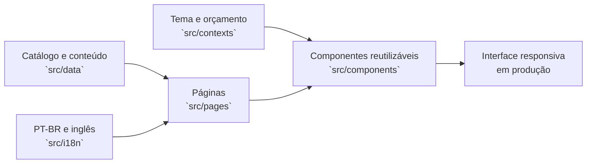

# Vesper Equipamentos EX — site institucional

> Estudo de caso público do site institucional da Vesper Equipamentos EX, desenvolvido para apresentar soluções de ventilação industrial em áreas classificadas.

[](https://vesper.ind.br/)
[](#stack)
[](docs/portfolio-release.md)

**[Ver site online](https://vesper.ind.br/)** · **[Ler estudo de caso](docs/case-study.md)** · **[Roteiro de demonstração](docs/demo-walkthrough.md)** · **[Notas de segurança](SECURITY.md)**


## Leitura rápida para recrutadores

| Em menos de dois minutos | Evidência disponível |
| --- | --- |
| **Entrega real** | [Site institucional em produção](https://vesper.ind.br/) e capturas feitas diretamente nele. |
| **Minha responsabilidade** | Design da interface, experiência responsiva, organização de conteúdo e implementação front-end. |
| **Escala da interface** | 13 páginas, 11 componentes reutilizáveis, dados de catálogo separados e traduções PT-BR/EN. |
| **Qualidade verificável** | GitHub Actions executa lint, validação do recorte público e build em todo push. |
| **Limite honesto** | Sem métricas inventadas e sem integrações operacionais, credenciais ou dados de lead nesta cópia. |

Para uma avaliação guiada, siga o [roteiro de demonstração](docs/demo-walkthrough.md).

## O projeto

Eu desenvolvi o design e a experiência de interface do site institucional da Vesper Equipamentos EX. O desafio era comunicar, com uma linguagem técnica e objetiva, uma linha de ventiladores e exaustores para ambientes industriais severos e áreas classificadas, sem transformar a navegação em um catálogo difícil de consultar.

O resultado organiza aplicações, produtos, locação, certificações, conteúdo institucional e caminhos de contato em uma interface responsiva. O projeto publicado está disponível em [vesper.ind.br](https://vesper.ind.br/).

## Minha atuação

- Direção visual e organização da experiência institucional.
- Interface responsiva para desktop e mobile.
- Hierarquia de conteúdo para produtos, aplicações, locação e certificações.
- Componentes reutilizáveis para navegação, cartões de produto, detalhes técnicos, breadcrumbs, busca e orçamento.
- Catálogo orientado por dados, preparado para PT-BR e inglês.
- Estados de interface, acessibilidade básica de navegação e feedback de interação.

  ### Operação e integrações em produção

Além da interface, fui responsável pelo deploy, configuração do domínio e manutenção contínua do site.

No ambiente de produção, o formulário utiliza um backend em **Python**, envio por **SMTP** e integração com **CRM**. Esses componentes, credenciais e configurações de infraestrutura foram removidos da edição pública para proteger o fluxo de leads e o ambiente da empresa.

## Evidências da entrega publicada

| Desktop | Mobile | Catálogo e aplicações |
| --- | --- | --- |
|  |  |  |

As capturas foram feitas no site público em **28 de julho de 2026**, sem criar contatos ou enviar formulários.

## Decisões de experiência

1. **Mensagem técnica logo na entrada.** O hero deixa explícitos o segmento EX, as aplicações e os principais caminhos de navegação.
2. **Da aplicação ao equipamento.** A home permite começar pelo contexto operacional e chegar ao catálogo, em vez de exigir que a pessoa já conheça o modelo do produto.
3. **Conteúdo industrial escaneável.** Certificações, linhas e benefícios são organizados em blocos curtos, com contraste e hierarquia para leitura rápida.
4. **Contato próximo do contexto.** Chamadas de orçamento e WhatsApp permanecem acessíveis sem interromper a exploração de produtos.
5. **Paridade mobile.** A estrutura não depende de hover e preserva os caminhos principais em telas menores.

Mais contexto está em [docs/case-study.md](docs/case-study.md).

## Arquitetura da interface



## Stack

- React 18 e Vite
- Tailwind CSS e PostCSS
- i18next / react-i18next para localização
- Lucide React para iconografia
- ESLint para qualidade estática

## Estrutura relevante

```text
src/
├── components/     componentes de interface e produto
├── contexts/       tema e lista de orçamento
├── data/           catálogo, especificações e conteúdo institucional
├── i18n/           traduções PT-BR e inglês
├── pages/          páginas e fluxos de navegação
└── utils/          eventos de interface e inteligência de produto
```

## Executar localmente

```powershell
npm ci
npm run dev
```

Validações disponíveis:

```powershell
npm run lint
npm run test:portfolio
npm run build
```

## Escopo desta cópia pública

Este repositório é uma versão preparada para portfólio. A experiência visual, os componentes e o catálogo público foram preservados; integrações operacionais de envio de e-mail, bibliotecas de transporte, configuração de FTP e referências de infraestrutura foram removidas intencionalmente.

O formulário desta cópia exibe um retorno de demonstração e **não envia leads para a empresa**. O site em produção possui sua própria operação de contato.

Leia [docs/portfolio-release.md](docs/portfolio-release.md) antes de reutilizar o projeto. Marca, conteúdo e ativos da Vesper permanecem sujeitos aos seus respectivos direitos.

## Autor

**Maycon Ferreira** — design e implementação da experiência de interface.

<https://github.com/Mayconxzdev>
