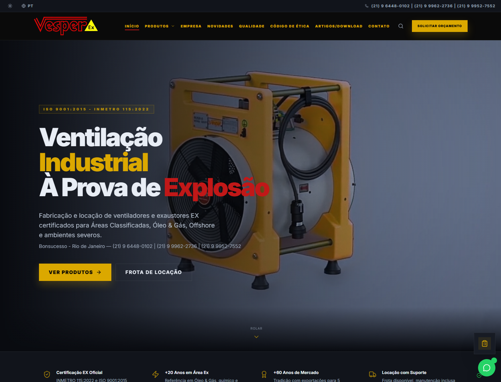
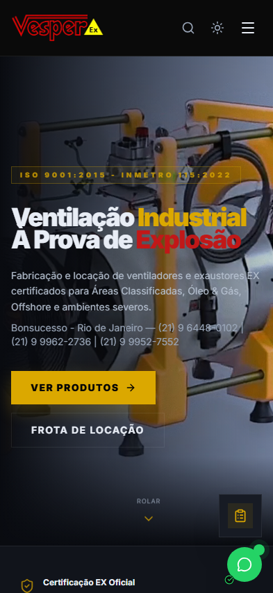
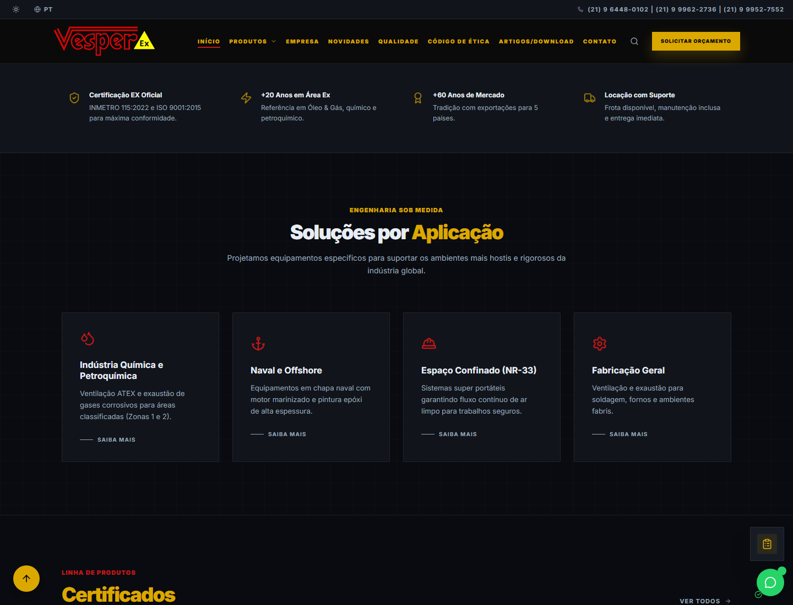
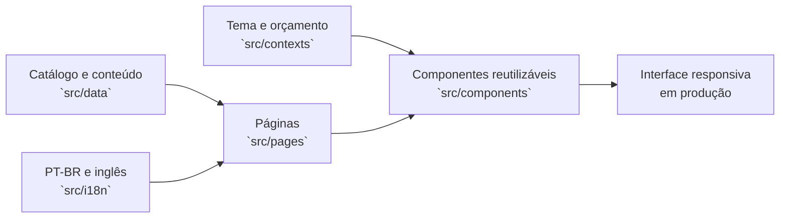

# Vesper Equipamentos EX — site institucional

> Versão pública do site institucional que desenvolvi para a Vesper Equipamentos EX, com foco em soluções de ventilação industrial para áreas classificadas.

[](https://vesper.ind.br/)
[](#stack)
[](docs/portfolio-release.md)

**[Ver site online](https://vesper.ind.br/)** · **[Detalhes do projeto](docs/case-study.md)** · **[Roteiro de uso](docs/demo-walkthrough.md)** · **[Segurança](SECURITY.md)**



## Visão geral

Desenvolvi o design e a interface do site institucional da Vesper Equipamentos EX. O objetivo foi apresentar ventiladores e exaustores para ambientes industriais severos e áreas classificadas sem transformar a navegação em um catálogo difícil de consultar.

| Aspecto | Situação atual |
|---|---|
| **Site publicado** | [vesper.ind.br](https://vesper.ind.br/) |
| **Minha atuação** | Direção visual, experiência responsiva, organização do conteúdo, implementação front-end, deploy, domínio e manutenção |
| **Estrutura** | 13 páginas, 11 componentes reutilizáveis, catálogo separado da interface e traduções PT-BR/EN |
| **Qualidade** | GitHub Actions com lint, validação da cópia pública e build |
| **Versão pública** | Sem credenciais, dados de lead ou integrações operacionais da empresa |

## O que desenvolvi

- direção visual e organização da experiência institucional;
- interface responsiva para desktop e mobile;
- hierarquia de conteúdo para produtos, aplicações, locação e certificações;
- componentes reutilizáveis para navegação, produtos, detalhes técnicos, breadcrumbs, busca e orçamento;
- catálogo orientado por dados, preparado para PT-BR e inglês;
- estados de interface, acessibilidade básica de navegação e feedback de interação;
- deploy, configuração de domínio e manutenção contínua.

No ambiente de produção, o formulário utiliza backend em **Python**, envio por **SMTP** e integração com **CRM**. Esses componentes, credenciais e configurações de infraestrutura foram removidos da edição pública para proteger o fluxo de leads e o ambiente da empresa.

## Interface publicada

| Desktop | Mobile | Catálogo e aplicações |
|---|---|---|
|  |  |  |

As capturas foram feitas no site público em **28 de julho de 2026**, sem criar contatos ou enviar formulários.

## Decisões de experiência

1. **Mensagem técnica logo na entrada.** O hero apresenta o segmento EX, as aplicações e os principais caminhos.
2. **Da aplicação ao equipamento.** A navegação permite começar pelo contexto operacional antes de escolher um modelo.
3. **Conteúdo industrial escaneável.** Certificações, linhas e benefícios aparecem em blocos curtos e hierarquizados.
4. **Contato próximo do contexto.** Orçamento e WhatsApp permanecem acessíveis durante a exploração.
5. **Paridade mobile.** Os fluxos principais não dependem de hover.

## Arquitetura da interface



## Stack

- React 18 e Vite
- Tailwind CSS e PostCSS
- i18next / react-i18next
- Lucide React
- ESLint

## Estrutura

```text
src/
├── components/     componentes de interface e produto
├── contexts/       tema e lista de orçamento
├── data/           catálogo, especificações e conteúdo institucional
├── i18n/           traduções PT-BR e inglês
├── pages/          páginas e fluxos de navegação
└── utils/          eventos de interface e inteligência de produto
```

## Executar localmente

```powershell
npm ci
npm run dev
```

```powershell
npm run lint
npm run test:portfolio
npm run build
```

## Estado e limites

Esta é uma cópia pública preparada para mostrar a interface e a organização do projeto. Integrações de e-mail, bibliotecas de transporte, FTP e referências de infraestrutura foram removidas. O formulário desta edição exibe apenas um retorno de demonstração e não envia leads para a empresa.

Marca, conteúdo e ativos da Vesper permanecem sujeitos aos respectivos direitos. Consulte [docs/portfolio-release.md](docs/portfolio-release.md) antes de reutilizar o projeto.

## Autor

**Maycon Ferreira** — design, implementação, deploy e manutenção da experiência de interface.

<https://github.com/Mayconxzdev>
